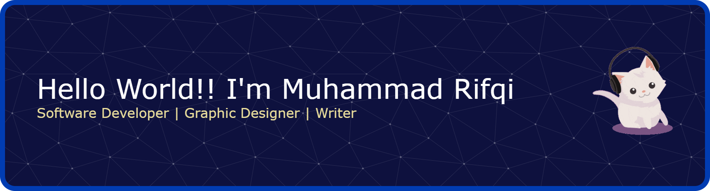

 

# Hii There, Welcome To My Profile 🤪👋

 

<picture>
  <source media="(prefers-color-scheme: dark)" srcset="https://raw.githubusercontent.com/JeanGunhildr/JeanGunhildr/output/pacman-contribution-graph-dark.svg">
  <source media="(prefers-color-scheme: light)" srcset="https://raw.githubusercontent.com/JeanGunhildr/JeanGunhildr/output/pacman-contribution-graph.svg">
  
</picture>

 

📌 I am a **first-semester college student majoring in Informatics Engineering at Jenderal Soedirman University.** I have a strong interest in programming and technology. Currently, I am learning the **Python** programming language and exploring topics in **machine learning and data**. I am also learning **Blender** to create games, and I have a keen interest in **graphic design** as well. 

---

> ## **🧠 Interests** 
-  Machine Learning   
-  Web Development   
-  Game Development   
-  Graphic Design   
-  Motion Graphics   
-  Writing   

---

> ## **📚 Currently Learning**
-  Python   
-  Blender   
-  React JS   
-  Figma   

---

> ## **🎬 Favorite Films**
-  Interstellar   
-  Harry Potter  
-  Gravity Falls  
-  Code Geass  
-  Monster  

---

> ## **⚡ Fun Facts**
- I like to write down ideas that come to my mind on a piece of paper  
- I enjoy discovering new things 

---

 

<h1 align="center">🛠️ Skills</h1>

 

---

> ## **Designs :**

  
 

---

> ## **Programing Languages :**

     
 

---

> ## **Frameworks and Libraries :**

           
 

---

> ## **Databases :**

 

---

 

<h1 align="center">🧩 Github Stats</h1>

 

---

  
  

---

 

<h1 align="center">🤝 Learn Partner </h1>

 

---

  

---

 

<h1 align="center">🌐 Social Media</h1>

 

---

   

---

 

<h1 align="center">🖼️ Portofolio</h1>

 

---

---

